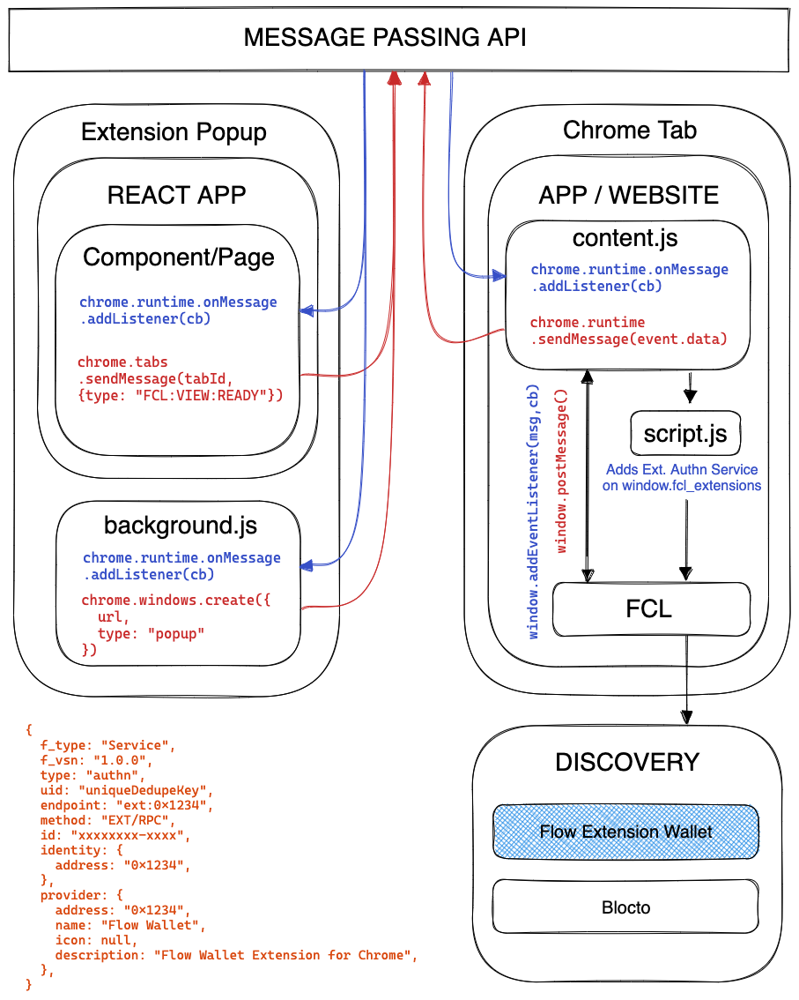
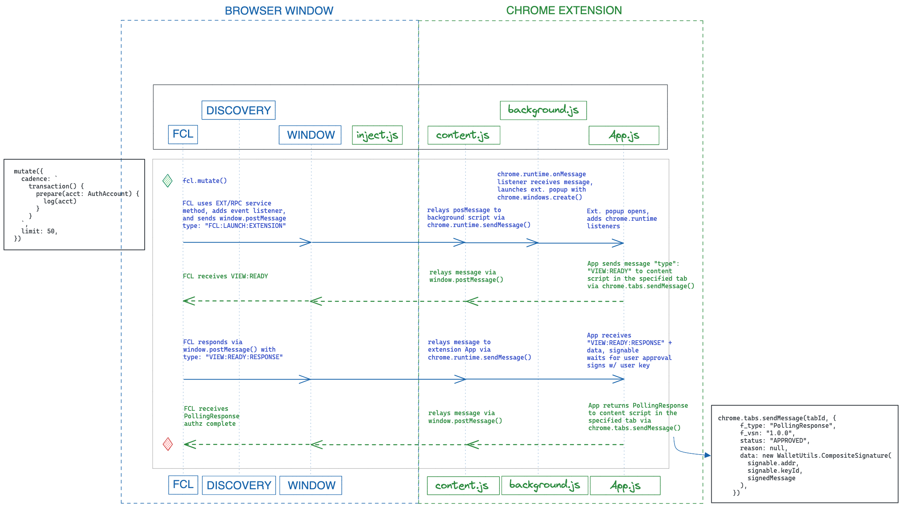

# FCL EXT/RPC Guide

*This guide will help you create a FCL compatible Chrome browser extension.*

## Overview
To get started, we will cover the most important aspects of Flow, FCL, and Chrome's APIs relevant to building this extension. Get started by reading the [FCL Overview](https://docs.onflow.org/fcl/) for a high level view of FCL and all its features. For an in-depth view of FCL communication patterns, see this [guide](https://github.com/onflow/fcl-js/blob/master/packages/fcl/src/wallet-provider-spec/draft-v3.md).

### FCL Fundamentals

#### Discovery
Dapps on Flow are encouraged to use FCL's [Discovery API](https://github.com/onflow/fcl-discovery) via a simple [configuration](https://docs.onflow.org/fcl/reference/api/#common-configuration-keys). This is so that dapps can support all wallets on Flow using the FCL interface without needing any custom code for specific ones. To become available on this list, you will need to a submit a PR to add your wallet to this list once the wallet is ready for testnet or mainnet use.

#### Service Methods
Services methods are the communication channels that FCL can use to pass messages to and from your wallet in order to fulfill user interactions. For extensions, we will be using RPC in the browser to communicate between the wallet and the dapp. For more context on service methods, see other supported methods [here](https://github.com/onflow/fcl-js/blob/master/packages/fcl/src/wallet-provider-spec/draft-v3.md#service-methods). Note that the EXT/RPC is not documented in the provider spec but is similar to the other front-channel communication methods.

#### Wallet Services
Wallet services are the features that your wallet will support. Wallets on Flow can choose to implement any number of supported FCL services. In order to gain broad adoption, it is reccomended to implement the following minimum:
- **Authentication (Authn) Service:** The wallet can provide the user's wallet address to the dapp and is confident in the user's identity using any authentication mechanism.
- **Authorization (Authz) Service:** The wallet can provide the appropriate signatures for transactions that the dapp requests.

See [here](https://github.com/onflow/fcl-js/blob/master/packages/fcl/src/wallet-provider-spec/draft-v3.md#overview) for a list of all supported FCL services, 


### Browser & Extension Requirements
- Chrome v99+
- Manifest V3 Required Permissions
  - [storage](https://developer.chrome.com/docs/extensions/mv3/manifest/storage/): TODO: Add reason
  - [activeTab](https://developer.chrome.com/docs/extensions/mv3/manifest/activeTab/): TODO: Add reason
  - [alarms](https://developer.chrome.com/docs/extensions/reference/alarms/): TODO: Add reason

### Key Scripts
There are 3 key scripts that FCL relies on to allow message passing between the extension and the dapp. The global separation of context created by Chrome between the two and the availability of Chrome APIs within those contexts require these scripts to be setup in a particular sequence so that the communication channels needed by FCL's EXT/RPC service method will work.

The following is an overview of these scripts and the functionality they need to support FCL:
- `background.js`: Used to launch the extension if selected by the user from Discovery via `chrome.windows.create`.
- `content.js`: Used to proxy messages between the dapp to the extension via `chrome.runtime.sendMessage` and send the id of the chrome extension to `script.js` right after it's injected.
- `script.js`: Injected by `content.js` into the dapp and waits for the id of the chrome extension to build the authn service and allow Discovery to launch the extension.



<details>
<summary>Application Context Diagram</summary>

</details>

## Implementation

### Installation & Configuration

Use the following versions of FCL within your extension - available via [NPM](https://www.npmjs.com/package/@onflow/fcl):
- **FCL Version**: `^0.0.79-alpha.3` 
- **HTTP Transport**: `^0.0.6`
    - Requires separate http-transport package from `@onflow/transport-http` installed as dependency

Configure FCL to use the HTTP API on the Access Node with the HTTP transport layer.
```js
import {config} from "@onflow/fcl"
import {send as httpSend} from "@onflow/transport-http"

config()
  fclConfig.put("accessNode.api", "https://rest-testnet.onflow.org")
  fclConfig.put("sdk.transport", httpSend)
```
See [here](https://docs.onflow.org/fcl/reference/configure-fcl/) for more configuration options. Note that many of these configuration options are dapp specific and not needed for the wallet.

**Manifest V3 configurations:**
```json
  ...

  "action": {
    "default_popup": "index.html",
    "default_title": "Open the popup"
  },
  "content_scripts": [
    {
      "matches": ["http://*/*", "https://*/*"],
      "js": ["content.js"]
    }
  ],
  "permissions": [
    "activeTab", 
    "storage", 
    "alarms"
  ],
  "web_accessible_resources": [
    {
      "resources": ["index.html", "script.js"],
      "matches": ["<all_urls>"]
    }
  ]

  ...
```
See [here](https://github.com/gregsantos/flow-wallet-extension/blob/master/public/manifest.json) for the full sample manifest v3 file.

### Harness & Testing
In order to test your FCL integration as you build your extension, you may want to use a simple sample dapp that can send authentication and authorization requests. We have created a [basic harness](https://github.com/orodio/harness) to use for development that you can download, run, and use against your extension. View the instructions on the harness to get it running.


### FCL Discovery
FCL Discovery relies on the global window object to find injected extensions in `window.fcl_extensions`. It expects extensions to have injected an specific object into the array that needs to proceed to authentication if the user chooses it and contains details like the extension endpoint to open on login, the FCL version and more. This object is created via [`script.js`](#) shouldn't need much modification past the `endpoint` key.
```js
const AuthnService = {
  f_type: "Service",
  f_vsn: "1.0.0",
  type: "authn",
  uid: `${id}#authn`,
  endpoint: `chrome-extension://${id}/index.html#/authn`,
  method: "EXT/RPC",	
  ...
}
if (!Array.isArray(window.fcl_extensions)) {
  window.fcl_extensions = []
}
window.fcl_extensions.push(AuthnService)
```
In order for `script.js` to push to the `window`, and the user to launch the extension from an unopened state, the following actions need to run in the following order:
1. `background.js` adds a listener for `FCL:LAUNCH:EXTENSION`
2. `content.js` injects separate script (`script.js`) into the window as it has no access to page window variables.
3. `content.js` sends `chrome.runtime.id` to `script.js` via `CustomEvent` (*timeout may be required) as Discovery will need this id to define the endpoint of the extension on initial open.
4. `script.js` listens for event from `content.js` and adds `AuthnService` on `window.fcl_extensions`. FCL checks for injected services to sends to Discovery.
5. Discovery is able display the extension as an available choice for the user as it pulls from the `window.fcl_extensions` array for the relevant information. If user selects the extension wallet, it uses the `endpoint` in the authn service and the `FCL:LAUNCH:EXTENSION` message to `background.js` to launch the extension. This is required due to the `chrome.windows.create` only being accessible by the background script.

All future actions that require the user to authenticate or authorize are proxied through `content.js` directly as the extension is already launched and has listeners mounted on `content.js` to pass messages.

<details>
<summary>FCL Discovery and Authn Sequence Diagram</summary>

</details>

### Account Creation
TODO: How to generate accounts and use the Account API

### FCL Authentication
Authentication is triggered either through Discovery or through any FCL transaction that requires authentication. When authentication is requested, the following should happen:
1. On opening of the authentication tab on the extension, it should fire a message of `{type: "FCL:VIEW:READY"}` via `chrome.tabs.sendMessage` to indicate to the dapp that it should wait for a response from the user within the extension. See [sample authn page](#).
2. The dapp will respond with `FCL:VIEW:READY:RESPONSE` which is received by `content.js` and sent to the authn page. The dapp will wait for an approved polling response from the extension.
3. Once the user has successfully authenticated, the extension should send a message of type `PollingResponse` with the `status` field as `"APPROVED"` and the relevant service objects returned. See [sample authn page](#).

All messages above are proxied through `content.js`.

<details>
<summary>FCL Discovery and Authn Sequence Diagram</summary>

</details>

### FCL Authorization
Authorization is very similar to authentication with the exception that the `"FCL:VIEW:READY:RESPONSE"` will contain additional data that contains the signable object (containing the relevant Cadence transaction, etc.).

The authorization should likely also listen for `FLOW::TX` messages to recieve the transactionID back from the dapp to recieve the status of the transaction.

In the `PollingResponse`, there should be a `data` field that contains a composite signature for the users transaction.

> **This composite signature will be generated using the users keys and should be done securely.** 

Although a [sample implementation](#) has been provided, you should thoroughly review your own signing functionality and ensure its security.

All messages above are proxied through `content.js`.


<details>
<summary>FCL Authz Sequence Diagram</summary>

</details>

### Other Services
Guides on implementing other wallets services for EXT/RPC will be coming shortly.

### Transaction History & Event Indexing
As a wallet, you may want to index events in order to track and display your user's past transactions. We have two recommended pre-built options on Flow:
- [Graffle](#): Hosted Service Provider
- [Flow Scanner](#): Open-source event indexing service that you will have configure and host


### NFT Viewing & Metadata
If you would like to support showing user's their NFTs and associated metadata, the current recommendation is to use the [Alchemy Flow API](https://docs.alchemy.com/flow/documentation/flow-nft-apis). The usage of the API is also demonstrated in the sample extension. While Alchemy will provide some basic metadata on the most popular Flow NFT projects, other projects and project specific fields will rely on their specific smart contract implementation. We have recently rolled out a NFT metadata standard that continues to evolve to solve this problem, read more about it [here](https://forum.onflow.org/t/introducing-nft-metadata-on-flow/2798).

### Other Resources
TODO: Useful Flow tooling, Other services (moonpay, etc.), Chrome extension guides
